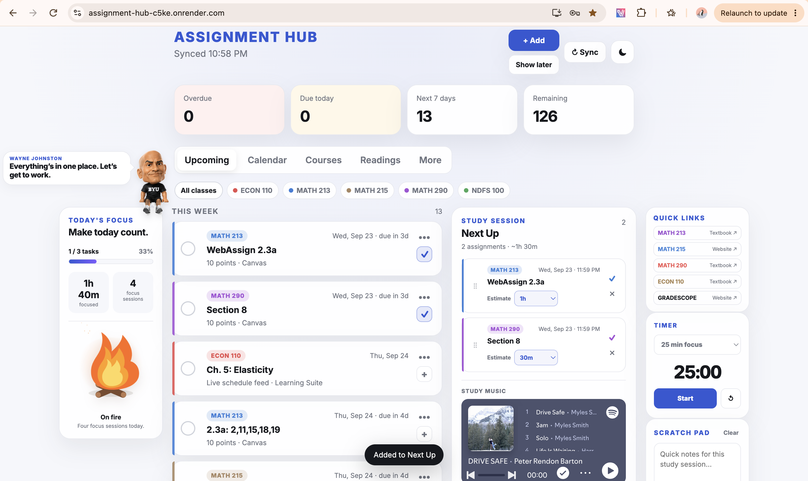
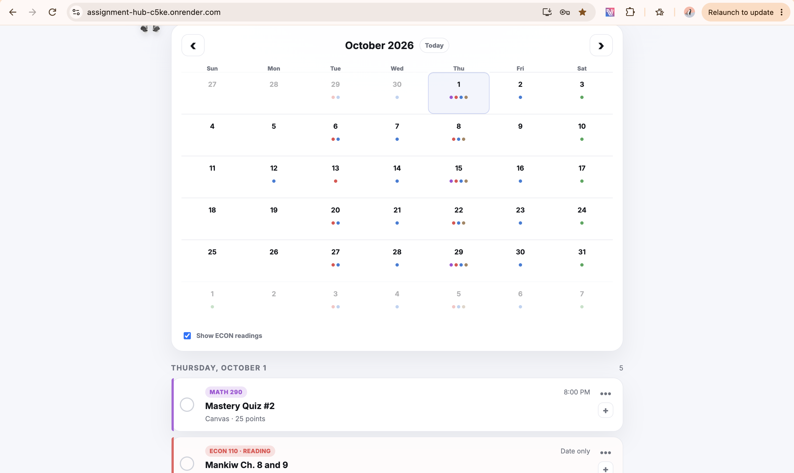
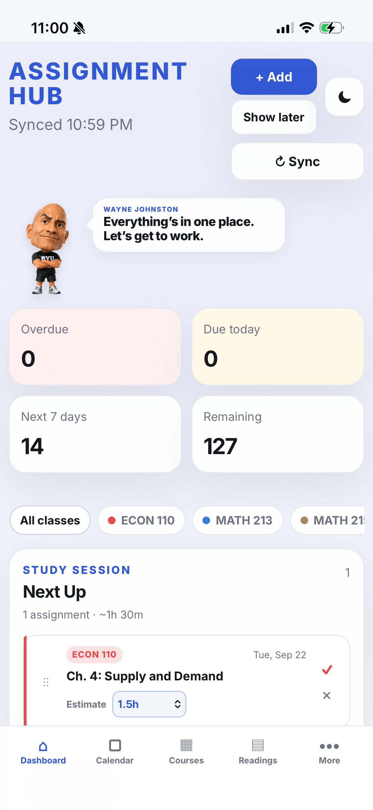

# BYU Assignment Hub

A mobile-friendly academic planning dashboard that brings coursework from BYU Canvas and Learning Suite into one place.

## Why I built it

My assignments were split across multiple university systems, which made it harder to see what was due and plan my week. I designed Assignment Hub as a single dashboard and calendar for coursework, deadlines, readings, and personal planning.

This project was developed with AI assistance. My role has centered on defining the product, designing workflows and interface behavior, testing features, identifying bugs, and iteratively refining the application through real-world daily use.

## Screenshots

### Desktop dashboard

### Calendar

### Mobile dashboard

  

## What it does

- Combines active Canvas assignments with Learning Suite coursework
- Separates graded assignments from scheduled readings
- Provides dashboard, course, reading, and calendar views
- Supports manual assignments, completion tracking, hiding/restoring items, and undo
- Stores personal checkoffs and manual items locally in the browser
- Includes responsive mobile navigation and Progressive Web App support
- Uses service-worker caching for a more app-like experience
- Supports optional password protection for hosted deployments

## How it works

The application uses a Python HTTP server to request coursework from the Canvas API and a Learning Suite iCal feed. The browser interface is built with JavaScript, HTML, and CSS. Canvas credentials are read from environment variables rather than stored in source code.

## Privacy and security

This repository should never contain a Canvas access token or a local `.env` file. Hosted deployments can use `HUB_PASSWORD` for access protection, and the server blocks requests for local environment and Git metadata.

## Project status

Assignment Hub is an active personal project and continues to evolve as I use it for my own coursework at Brigham Young University.

## Development approach

Assignment Hub is an AI-assisted project. I use AI coding tools to help implement features while I direct product requirements, user experience decisions, testing, debugging, and iteration. I am also using the project as a way to learn more about the technologies behind a working web application.

## Running locally

1. Copy `.env.example` to `.env`.
2. Add your own Canvas personal access token to `CANVAS_TOKEN`.
3. Optionally add your own Learning Suite iCal feed and course links.
4. Run `python3 server.py` and open the local address shown in the terminal.

The public portfolio copy intentionally contains no personal Canvas token, Learning Suite feed, course-specific IDs, or private configuration.
